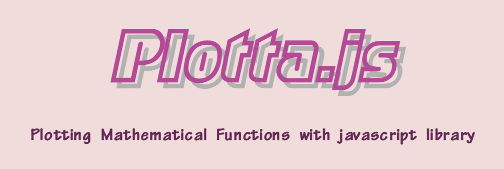

This page `introduces` plotta.js and provides `examples` and `API descriptions`.

This page was created using `React.js`

## Plotta.js GitHub

- [Plotta.js](hub.com/iamsjy17/Plotta/)

## License

Plotta.js And Plotta.js page is released under the [MIT license](https://opensource.org/licenses/MIT).

## Using Library
